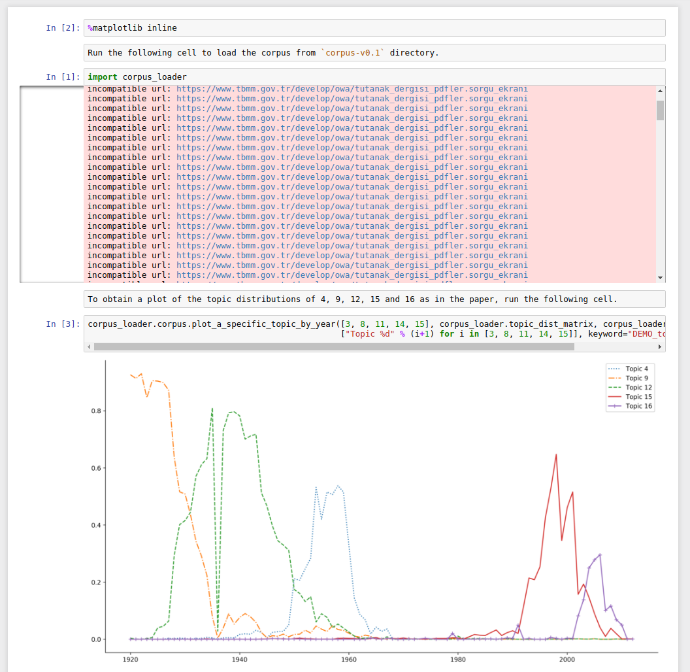

# A Corpus of Grand National Assembly of Turkish Parliament's Transcripts

## To reference this work, use:

    @InProceedings{GUNGOR18.19,
    author = {Onur Gungor ,Mert Tiftikci and Çağıl Sönmez},
    title = {A Corpus of Grand National Assembly of Turkish Parliament's Transcripts},
    booktitle = {Proceedings of the Eleventh International Conference on Language Resources and Evaluation (LREC 2018)},
    year = {2018},
    month = {may},
    date = {7-12},
    location = {Miyazaki, Japan},
    editor = {Darja Fišer and Maria Eskevich and Franciska de Jong},
    publisher = {European Language Resources Association (ELRA)},
    address = {Paris, France},
    isbn = {979-10-95546-02-3},
    language = {english}
    }

==== Scroll down for English.

Bu repoda TBMM'nin 1920 ve 2015 arasındaki genel kurul tutanaklarının dijitalleştirilmiş hallerinin bir derlemini bulabilirsiniz.

Sunduğumuz kodlar kullanılarak bazı sorgular yapıp derlemi analiz edebilirsiniz. Bunun örneklerine LREC 2018 kapsamında gerçekleştirilen ParlaCLARIN çalıştayında sunduğumuz [makaleden](http://lrec-conf.org/workshops/lrec2018/W2/summaries/19_W2.html) ulaşılabilir.

Eğer katkıda bulunmak isterseniz, [Onur Güngör](onurgu@boun.edu.tr) ile iletişime geçin.

==== English

This is a compilation of the transcripts of Grand National Assembly of Turkish Parliament (TBMM) meetings which span nearly a century between 1920 and 2015.

One can use supplied software to query and analyze the content. See [this paper](http://lrec-conf.org/workshops/lrec2018/W2/summaries/19_W2.html) from ParlaCLARIN Workshop at LREC 2018 for sample analyses on the corpus.

If you want to contribute, please contact [Onur Güngör](onurgu@boun.edu.tr).

We also provide the most recent version of the corpus at 
[Releases](https://github.com/onurgu/turkish-parliament-texts/releases) section.

## Contributing

If you want to contribute, you can follow these simple steps to create a development
environment:

    git clone https://github.com/onurgu/turkish-parliament-texts/releases
    
    wget http://voltran.cmpe.boun.edu.tr/temporary_download/datasets/tbmm/corpus-dev.tar.gz
    tar -zxvf corpus-dev.tar.gz
    
    pip3 install pipenv
    pipenv install --python 3
    
### Building the corpus

    nohup python -m corpus_compiler.builder --command construct_corpus --corpus_filename corpus-v0.4b/tbmm_corpus.mm --train_lda --vocabulary_filename corpus-v0.4b/vocabulary >> construct_vocab.nohup &
    
### Using the Jupyter notebook

You can use the `notebook.ipynb` file to load and query the corpus.

Example code to save a figure (using the small development corpus):
   
    pipenv shell
    ipython
    import corpus_loader
    
    corpus = corpus_loader.load(corpus_filepath="./corpus-dev/tbmm_corpus.mm")
    
    lda, topic_dist_matrix, label_vector = corpus_loader.load_lda_model(corpus, "./corpus-dev/tbmm_corpus.mm.tbmm_lda.model")
    
    # plot distribution of "mebus" and "milletvekil" keywords
    corpus_loader.corpus.plot_word_freqs_given_a_regexp_for_each_year([r"^mebus",r"^milletvekil"], ["mebus", "milletvekili"], keyword="milletvekil_and_mebus",)
    
    # to see plotted values 
    plot_values, counts, total_count, all_keywords = corpus_loader.corpus._word_freqs_given_a_regexp_for_each_year(r"^(milletvekil|vekil)", keyword="milletvekil",)
   
    

